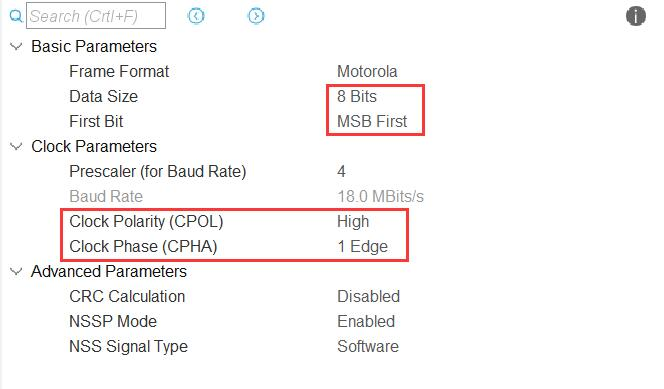

# Floyd-Fish/ST7789-STM32 fork with fixed DMA colors
Origianl Floyd-Fish lib has a problem with color output when using DMA - colors are mixed up. The code may not compile at all with an error, or produce firmware with mixed up colors during DMA

# List of changes:
-Correct display of colors with DMA

-Removed interference on the screen when turning on

-Added functions for drawing using DMA

# ST7789-STM32-DMA
Using STM32's Hardware SPI(with simple DMA support) to drive a ST7789 based LCD display.

## How to use ?

1. Copy the "st7789" dir to your project src path, add it to include path   
2. Include `"st7789.h"` in where you want to use this driver.   
3. Configure parameters in `"st7789.h"` according to your own display panel  
4. In system startup, perform `ST7789_Init();`.  
5. Run a `ST7789_Test()` to exam this driver.  
6. Run a `ST7789_TestColors()` to test colors 
7. Don't forget to turn the backlight on  

This code has been tested on 240x240 & 170x320 LCD screens.
  
> Most MCUs don't have a large enough RAM, so a framebuffer is "cut" into pieces, e.g: a 240x5 pixel buffer for a 240x240 screen.  

## SPI Interface

If you are using **Dupont Line(or jumper wire)**, please notice that your CLK frequency should not exceed 40MHz (may vary, depends on the length of your wire), **otherwise data transfer will collapse!**  
For higher speed applications, it's recommended to **use PCB** rather than jumper wires.  

In STM32CubeMX/CubeIDE, config the SPI params as follow:

I've had a simple test, connect the screen and mcu via 20cm dupont line, and it works normally on **21.25MB/s**. And if I connect a logic analyzer to the clk and data lines(15cm probe), **21.25MB/s doesn't work anymore**, I have to lower its datarate to 10.625MB/s. Using PCB to connect the display, it works up to **40MB/s** and still looks nice.

## Supported Displays

- 135*240   
- 240*240   
- 170*320 (new)  

If you like, you could customize it's resolution to drive different displays you prefer. 
> For example, a 240x320 display is perfectly suited for st7789.  
> Just set all X_SHIFT and Y_SHIFT to 0, and set resolution to 240|320.  

For more details, please refer to ST7789's datasheet.  

# Powerful fork

https://github.com/deividAlfa/ST7789-STM32-uGUI

# Special thanks to

### Helped fix the library
- https://github.com/drunkbatya

#### Reference
- [ananevilya's Arduino-ST7789-Lib](https://github.com/ananevilya/Arduino-ST7789-Library)  
- [afiskon's stm32-st7735 lib](https://github.com/afiskon/stm32-st7735)

#### Contributor
- [JasonLrh](https://github.com/JasonLrh)  
- [ZiangCheng](https://github.com/ZiangCheng)  
